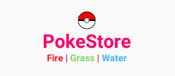
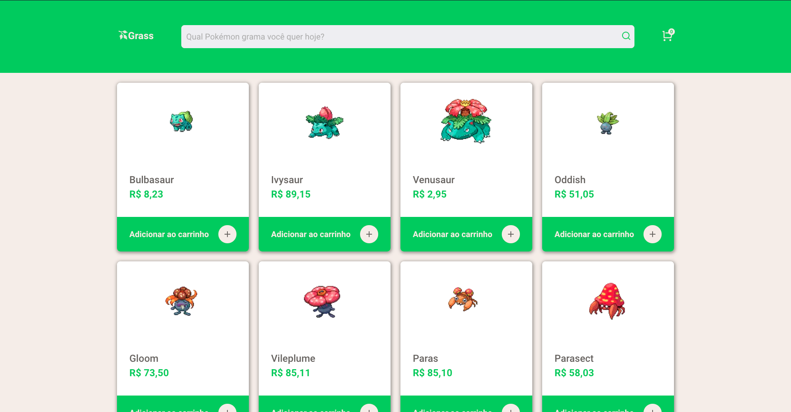
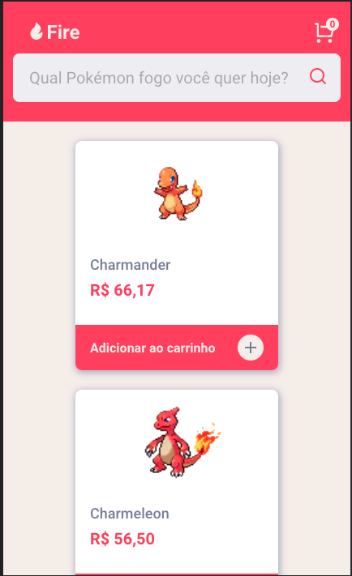

<h1 align="center">
    
</h1>

<h4 align="center">
  PokeStore Challenge
</h4>

  

  
  
  

  <a href="#-tecnologias">Tecnologias</a>&nbsp;&nbsp;&nbsp;|&nbsp;&nbsp;&nbsp;
  <a href="#-projeto">Projeto</a>&nbsp;&nbsp;&nbsp;|&nbsp;&nbsp;&nbsp;
  <a href="#-temas">Temas e Váriaveis de ambiente</a>&nbsp;&nbsp;&nbsp;

 

  
  

## Tecnologias

Esse projeto foi desenvolvido usando as seguintes tecnologias:

- [NextJS](https://nextjs.org/) - como framework pois possibilita uma experiência de desenvolvimento incrível.
- [TypeScript](https://www.typescriptlang.org/) - pois facilita e permite o projeto escalar, dando melhor suporte no desenvolvimento e manutenção
- [ContextAPI](https://nextjs.org/) - para gerenciamento de estados, pois é disponível nativamente no React
- [React Query](https://react-query.tanstack.com/) - para gerenciamento das requisições e controle de cache, pois é uma ferramenta poderosa, permitindo o gerenciamento e controle de todas requisições
- [Styled Components](https://styled-components.com/) - para estilos e temas
- [Axios](https://github.com/axios/axios) - para requisições à api
- [Jest](https://jestjs.io/pt-BR/) - para testes 

O Deploy foi feito na [Vercel](https://vercel.com/home).

Para listagem dos pokemons, foi utilizada a api pública [PokeAPI](https://pokeapi.co/).

## 💻 Projeto

PokeStore é um projeto que visa criar uma loja Pokémon virtual, com a listagem de produtos, carrinho de compras e finalizar a compra.

O projeto possui as seguintes funcionalidades:
- Catálogo de produtos
- Carrinho lateral
- Resumo do carrinho
- 3 lojas com estilos e tipos diferentes de Pokémon
- Barra de busca para filtrar os Pokémon
- Botão de finalizar compra, reiniciando o processo de compra
- Modal de obrigado ao finalizar compra
- Salvar os dados da compra do usuário localmente para não perdê-las ao atualizar a página
- Testes

É possível acessar o projeto a partir das seguintes urls:
- grass: https://grass-pokestore.vercel.app/
- fire: https://fire-pokestore.vercel.app/
- water: https://water-pokestore.vercel.app/

## 🔖 Temas e Variáveis de ambiente

O projeto contempla diferentes estilos de lojas, que podem ser alterados mudando somente uma variável de ambiente, podendo assumir os seguintes valores:

- `NEXT_PUBLIC_POKESTORE_THEME=fire`
- `NEXT_PUBLIC_POKESTORE_THEME=water`
- `NEXT_PUBLIC_POKESTORE_THEME=grass`

Feito com orgulho! Por [Lucas Oliveira](https://www.linkedin.com/in/lucasoliveiracruz).
